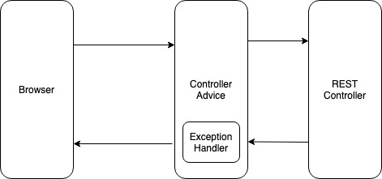

/api/students/ return List<Student>
As long Jackson is imported, spring automatically handle data-binding

1. create error response class
2. create exception class
3. update rest service return the response class if not found
4. add exception handler with @ExceptionHandler

